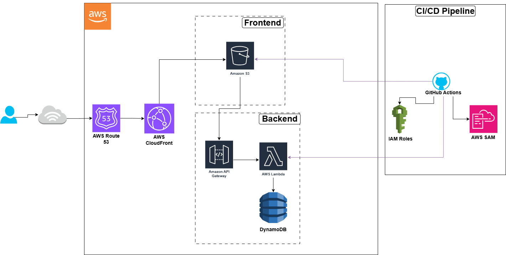

# ☁️ Cloud Resume API (Backend)

Este repositório contém a infraestrutura e a lógica de backend para o meu Cloud Resume Challenge. É uma API serverless desenhada para ser escalável, segura e de baixo custo.

🏗️ Arquitetura do Backend


A solução utiliza uma arquitetura puramente Serverless:
- API Gateway: Ponto de entrada REST para os pedidos do frontend.
- AWS Lambda (Python 3.13): Lógica de processamento para incrementar e devolver o contador de visitas.
- Amazon DynamoDB: Base de dados NoSQL para persistência do estado do contador.
- AWS SAM (Serverless Application Model): Framework de IaC para definição e deploy dos recursos.

## 🔒 Segurança & CI/CD (OIDC)
Um dos maiores focos deste projeto foi a segurança. 
- **Zero Static Credentials:** O pipeline de CI/CD via **GitHub Actions** utiliza **OpenID Connect (OIDC)** para autenticação na AWS.
- **IAM Least Privilege:** A Role de deploy e a Role da Lambda têm permissões restritas apenas aos recursos necessários (S3, DynamoDB, Logs).

## 🚀 Como fazer o Deploy

### Pré-requisitos
- AWS SAM CLI instalado.
- Python 3.13+.

### Comandos Principais
```bash
# Validar o template SAM
sam validate

# Build da aplicação (usa container para isolar dependências)
sam build --use-container

# Deploy manual (apenas para a primeira vez ou testes)
sam deploy --guided
